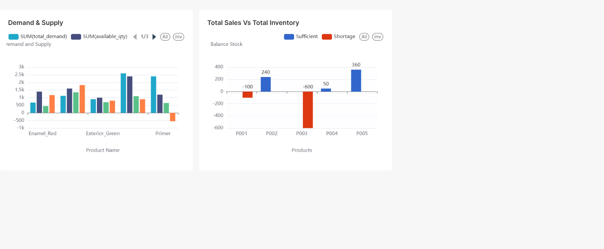

# AWS Data Lake – Paint Manufacturing (FMCG)

This repository contains a cloud-based **Data Lake and Analytics Pipeline** for a **paint manufacturing FMCG company**.  
The goal is to integrate **sales orders, ERP inventory, and production planning data** into a single AWS data platform for better demand vs. supply insights.

---

**Workflow:**
1. Raw data files uploaded to **Amazon S3**
2. Data cataloged using **AWS Glue Crawlers**
3. ETL pipeline with **AWS Glue (PySpark)**
4. Processed data stored in **S3 (Processed Zone)**
5. Dashboards built with **Apache Superset** hosted on EC2 instance

---

## Dataset
- **Sales Orders (`sales_orders.csv`)**
- **Inventory (`inventory.csv`)**
- **Production Plan (`production_plan.csv`)**

---

## AWS Services Used
- **Amazon S3** – Data Lake Storage  
- **AWS Glue** – ETL Jobs + Crawlers  
- **AWS Athena** – For quick insight and dataset view   
- **Apache Superset** – Visualization  

---

## Scripts
- `scripts/glue_etl_job.py` → PySpark ETL job  
- `scripts/athena_sql_datasets.sql` → queries for visualization dataset

---

## Sample Dashboard

---

## Business Value
- Unified data from **ERP + Sales + Production**  
- Analysis on **sales and inventory**  
- Enabled real-time monitoring via dashboards  

---

## Author
**Reena Khimji Bhanushali**  
*Data Engineer | AWS | ETL | SQL | Cloud* 

